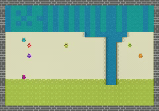
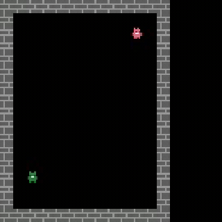
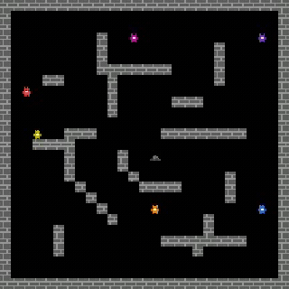
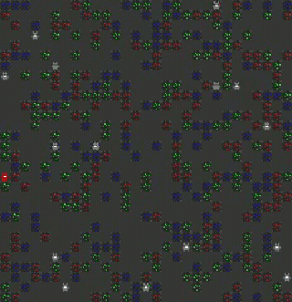

# Molten Pot

> **Anonymised review repository** accompanying the NeurIPS submission
> *Molten Pot: Evaluations & Datasets for Offline Social Reinforcement
> Learning*. The code, configs, and dataset URL have been stripped of
> any author-identifying information; the same artefacts will be
> released under the authors' identities at publication time.

<p align="center">
  
  
  
  
  
</p>
<p align="center"><sub>End-of-training PPO rollouts on each of the five
mixed-motive substrates: <em>Clean Up</em>, <em>Coins</em>,
<em>Coop Mining</em>, <em>Commons Harvest</em>,
<em>Allelopathic Harvest</em>.</sub></p>

Molten Pot is an offline reinforcement-learning benchmark built on
mixed-motive substrates from MeltingPot. The purpose of this
repository is to make it possible to **re-run the social offline RL
benchmark from the paper**: training and evaluating the four offline
RL algorithms (BC, BCQ, IQL, CQL) across the three evaluation
settings — *Setting 1* single-scenario offline RL, *Setting 2*
multi-scenario offline RL with the scenario label withheld, and
*Setting 3* zero-shot social generalisation across disjoint
train/test scenario splits.

---

## 🔭 Explore the benchmark in your browser

> ### **[👉 Open the interactive scenario browser →](https://frmjua.github.io/moltenpot/)**
>
> Watch every scenario come to life. For each of the **47 scenarios**
> the live site shows
> a 🎬 **start-of-training rollout** side-by-side with the
> 🏁 **end-of-training rollout** so you can *see* the behaviour policy
> learn,
> a 📊 **return-distribution histogram** of the data we logged across
> PPO training, and
> a 📈 **Setting 1 vs Setting 2** offline-RL comparison plot showing
> how the four algorithms do on that scenario.
>
> A separate
> [**Setting 3 splits view**](https://frmjua.github.io/moltenpot/splits.html)
> tiles all 18 train→test partitions as Train ↓ Test mosaics, so the
> distribution shift each split is testing is visible at a glance.
>
> No install required — just point your browser at
> [`frmjua.github.io/moltenpot`](https://frmjua.github.io/moltenpot/).

---

<p align="center">
  <a href="https://huggingface.co/datasets/frmjua/moltenpot">
    
  </a>
</p>
<p align="center">
  <strong>~1 TB</strong> of focal-agent trajectories — released anonymously on the
  Hugging Face Hub and <em>auto-downloaded the first time a training run needs them</em>:
  <a href="https://huggingface.co/datasets/frmjua/moltenpot"><code>frmjua/moltenpot</code></a>.
</p>

|   |   |
|---|---:|
| Substrates | **5** |
| Scenarios | **47** |
| Episodes | **~47,000** |
| Episode horizon | **1,000** timesteps |
| Focal-agent trajectories | **~186,000** |
| Focal-agent transitions | **~185 million** |
| Total size on disk | **~1 TB** |

<sub>Across 47 scenarios with 1–14 focal agents each, every episode is recorded
from every focal agent's perspective; trajectories are logged uniformly across
PPO training so each scenario's dataset is a skill-mixed cross-section from
random initialisation to the converged behaviour policy.</sub>

---

## Repository layout

```
moltenpot/
├── moltenpot/                    # core library
│   ├── model.py                  # MoltenpotAgent — CNN + GRU + Actor-Critic
│   ├── workers.py                # Ray actors: RolloutWorker, PPOLearner, HDF5Writer
│   ├── wrappers.py               # MeltingPotShimmy — Gym-style env adapter
│   ├── data_utils.py             # PyTorch Datasets streaming from HDF5
│   ├── hub.py                    # HuggingFace Hub auto-download
│   └── algorithms/
│       ├── bc.py                 # Behavioural Cloning
│       ├── bcq.py                # Batch-Constrained Q-Learning
│       ├── iql.py                # Implicit Q-Learning
│       ├── cql.py                # Conservative Q-Learning
│       └── eval_utils.py         # parallel multi-scenario evaluation
├── configs/
│   ├── train_ppo.yaml            # PPO data collection
│   ├── train_offline.yaml        # Offline RL training
│   ├── algorithm/{bc,bcq,iql,cql}.yaml
│   └── experiment/               # per-substrate / per-split training configs
├── scripts/
│   ├── train_ppo.py              # online PPO data collection
│   ├── train_offline.py          # offline RL training entry point
│   └── download_datasets.py      # bulk-download from the Hub before training
└── tests/                        # model + env-wrapper unit tests
```

---

## Installation

We use [`uv`](https://docs.astral.sh/uv/) for environment and package
management. If you don't already have it installed:

```bash
curl -LsSf https://astral.sh/uv/install.sh | sh
```

Then create a Python 3.11 environment (matches the pin in
`pyproject.toml`) and install the package:

```bash
uv venv --python 3.11
source .venv/bin/activate
uv pip install -e .
```

This pulls a CPU-friendly PyTorch by default. To use a GPU, install a
CUDA-matching PyTorch wheel afterwards — see
<https://pytorch.org/get-started/locally/> for the right wheel URL,
e.g.:

```bash
uv pip install --upgrade torch --index-url https://download.pytorch.org/whl/cu128
```

You will additionally need the official MeltingPot package (the env
wrappers in `moltenpot/wrappers.py` import from it lazily):

```bash
uv pip install dm-meltingpot
```

---

## Reproducing the paper's results

### 1. Train an offline RL algorithm on a single scenario (Evaluation 1)

```bash
python scripts/train_offline.py \
    algorithm=iql \
    substrate=clean_up \
    train_mode=clean_up_0 \
    in_dist_scenarios='[clean_up_0]' \
    out_dist_eval=false \
    data_root=data/clean_up \
    seed=1
```

The dataset is auto-downloaded from
`frmjua/moltenpot` on first use.

### 2. Train across all scenarios in a substrate (Evaluation 2)

```bash
python scripts/train_offline.py \
    +experiment=benchmark_coins_ALL \
    algorithm=iql \
    seed=1
```

### 3. Train on a held-out split (Evaluation 3)

```bash
python scripts/train_offline.py \
    +experiment=benchmark_clean_U1 \
    algorithm=cql \
    seed=1
```

The 18 splits referenced in the paper are defined in
`configs/experiment/benchmark_*.yaml`.

---

## Running the test suite

```bash
uv pip install -e ".[dev]"
pytest tests/
```

---

## Notes on Weights & Biases

The training scripts log to W&B by default. Reviewers can either:

- export `WANDB_MODE=offline` to skip the login step, or
- pass `wandb.enabled=false` on the command line, or
- log in with their own W&B account; no shared project credentials are
  required.

---

## Re-collecting a dataset (optional)

If you want to regenerate any per-scenario dataset from scratch via
independent PPO instead of downloading it from the Hub:

```bash
python scripts/train_ppo.py \
    substrate=clean_up \
    scenarios=clean_up_0 \
    num_actors=8 \
    total_steps=10_000_000 \
    output=data/clean_up/clean_up_0/dataset.hdf5
```

This is not required to reproduce any of the offline-RL training
results — those auto-download the released datasets from the Hub.
